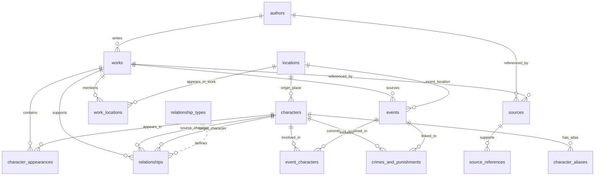

# MythosDB Entity Relationship Diagram

This page shows the main relationships between the MythosDB tables.

GitHub should render the Mermaid diagram below automatically.



---

## Relationship Notes

The main dataset uses several different relationship patterns.

### One-to-many examples

One author can be linked to many works:

```text
authors.author_id → works.author_id
```

One location can be linked to many characters as an origin location:

```text
locations.location_id → characters.origin_location_id
```

### Many-to-many examples

Characters can appear in many works, and works can contain many characters. This is handled through:

```text
character_appearances.csv
```

Events can involve many characters, and characters can appear in many events. This is handled through:

```text
event_characters.csv
```

Works can mention many locations, and locations can appear in many works. This is handled through:

```text
work_locations.csv
```

### Self-referencing character relationships

The `relationships.csv` table links characters to other characters:

```text
source_character_id → characters.character_id
target_character_id → characters.character_id
```

This allows relationships such as:

```text
Zeus parent_of Athena
Athena ally_of Odysseus
Achilles killed Hector
```

This table is intentionally flexible because mythology is full of family relationships, alliances, rivalries, divine punishments, transformations, revenge, and questionable life choices in sandals.
