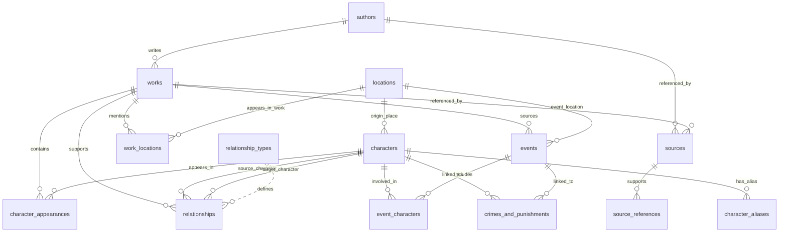

# MythosDB Entity Relationship Diagram

This document shows the main relationships between the MythosDB tables.

GitHub should render the Mermaid diagram below automatically.



---

## Table Relationship Summary

### Authors and Works

One author can be linked to many works.

```text
authors.author_id → works.author_id
```

One author can also be linked to source records.

```text
authors.author_id → sources.author_id
```

---

### Works and Character Appearances

One work can contain many character appearances.

```text
works.work_id → character_appearances.work_id
```

One character can appear in many works.

```text
characters.character_id → character_appearances.character_id
```

The `character_appearances.csv` table handles the many-to-many relationship between characters and works.

---

### Characters and Locations

One location can be linked to many characters as an origin location.

```text
locations.location_id → characters.origin_location_id
```

---

### Works and Locations

One work can mention many locations, and one location can appear in many works.

This is handled through:

```text
work_locations.csv
```

Key links:

```text
works.work_id → work_locations.work_id
locations.location_id → work_locations.location_id
```

---

### Events and Characters

One event can involve many characters, and one character can appear in many events.

This is handled through:

```text
event_characters.csv
```

Key links:

```text
events.event_id → event_characters.event_id
characters.character_id → event_characters.character_id
```

---

### Events and Locations

Each event can be linked to a primary location.

```text
locations.location_id → events.primary_location_id
```

---

### Events and Works

Each event can be linked to a source work.

```text
works.work_id → events.source_work_id
```

---

### Character Relationships

The `relationships.csv` table links characters to other characters.

```text
relationships.source_character_id → characters.character_id
relationships.target_character_id → characters.character_id
```

This supports records such as:

```text
Zeus parent_of Athena
Athena ally_of Odysseus
Achilles killed Hector
```

The relationship type can also be linked to:

```text
relationship_types.relationship_type → relationships.relationship_type
```

---

### Character Aliases

One character can have many aliases.

```text
characters.character_id → character_aliases.character_id
```

Aliases may include:

- Greek forms
- Roman equivalents
- spelling variants
- titles
- epithets

---

### Sources and Source References

The `sources.csv` table stores source information.

The `source_references.csv` table links specific dataset records to sources.

```text
sources.source_id → source_references.source_id
```

The fields `entity_type` and `entity_id` identify the record being referenced.

Example:

```text
entity_type = character
entity_id = 55
source_id = 1
```

This means character ID 55 is linked to source ID 1.

---

### Crimes and Punishments

The `crimes_and_punishments.csv` table can link to both events and characters.

```text
events.event_id → crimes_and_punishments.event_id
characters.character_id → crimes_and_punishments.character_id
```

This allows analysis of selected mythological actions by:

- character
- event
- severity rating
- mythological category
- modern UK legal comparison
- likely legal status today

---

## Notes on Many-to-Many Tables

The following tables are used to manage many-to-many relationships:

| Table | Purpose |
|---|---|
| `character_appearances.csv` | Links characters to works |
| `event_characters.csv` | Links characters to events |
| `work_locations.csv` | Links works to locations |

These tables are important for SQL joins, Power BI modelling, and relational analysis.

---

## Notes on Flexible Relationships

Some relationships in mythology are uncertain, disputed, or source-dependent.

The `relationships.csv` table is designed to support this by including:

```text
relationship_type
source_work_id
notes
```

Where a relationship is uncertain, the notes field should explain the uncertainty clearly.
